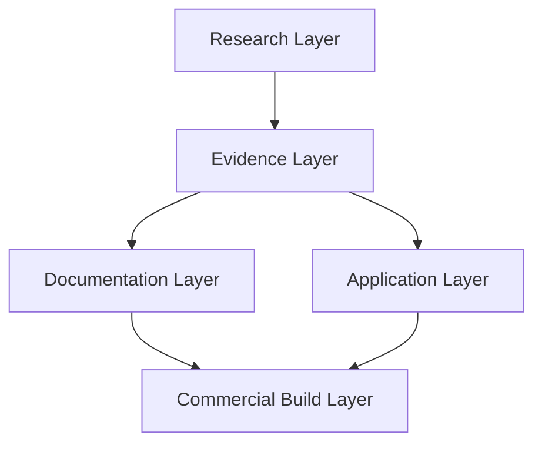
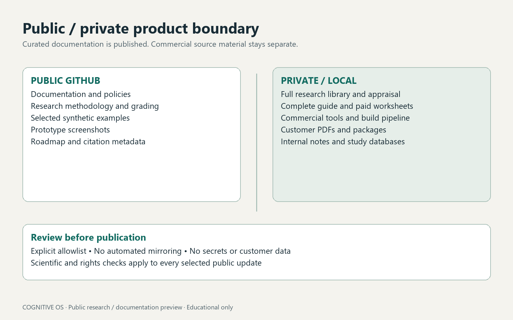
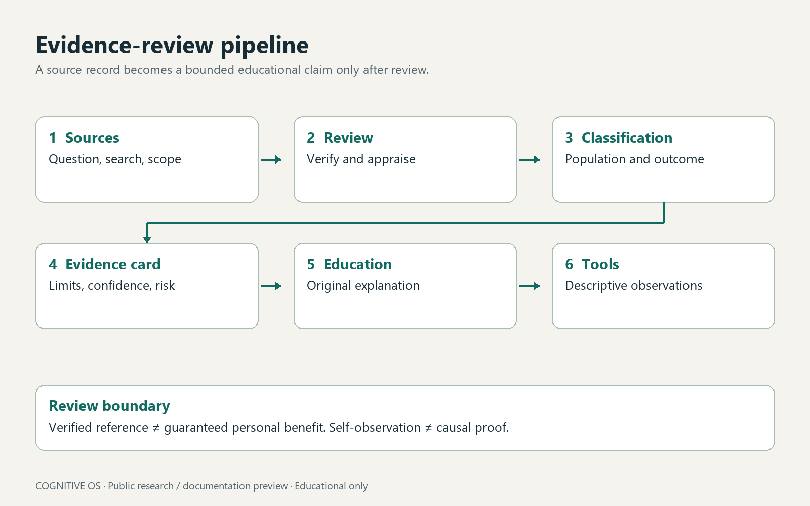

# Public architecture overview
## Research pipeline

## Product layers

These are information-flow diagrams, not claims of biological causation. Detailed research databases and build implementation remain private.

## Public / private boundary

There is no automatic mirror. Screenshots use synthetic observations. Only deliberately selected public files enter this repository. The private dashboard uses a lightweight browser runtime, localStorage and customer-controlled exports; no public backend is required.

