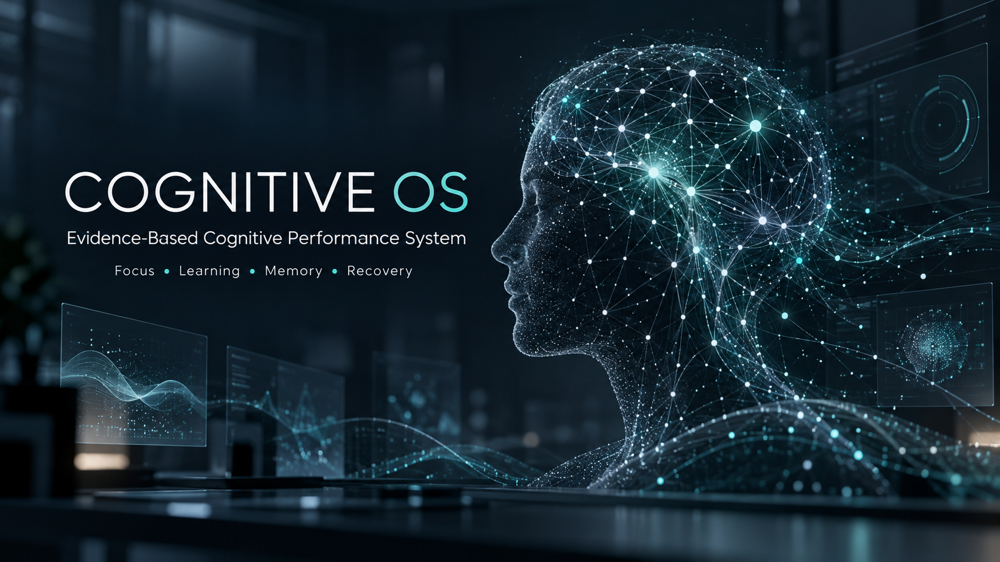
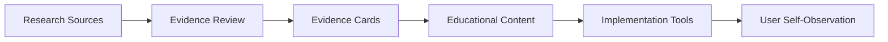
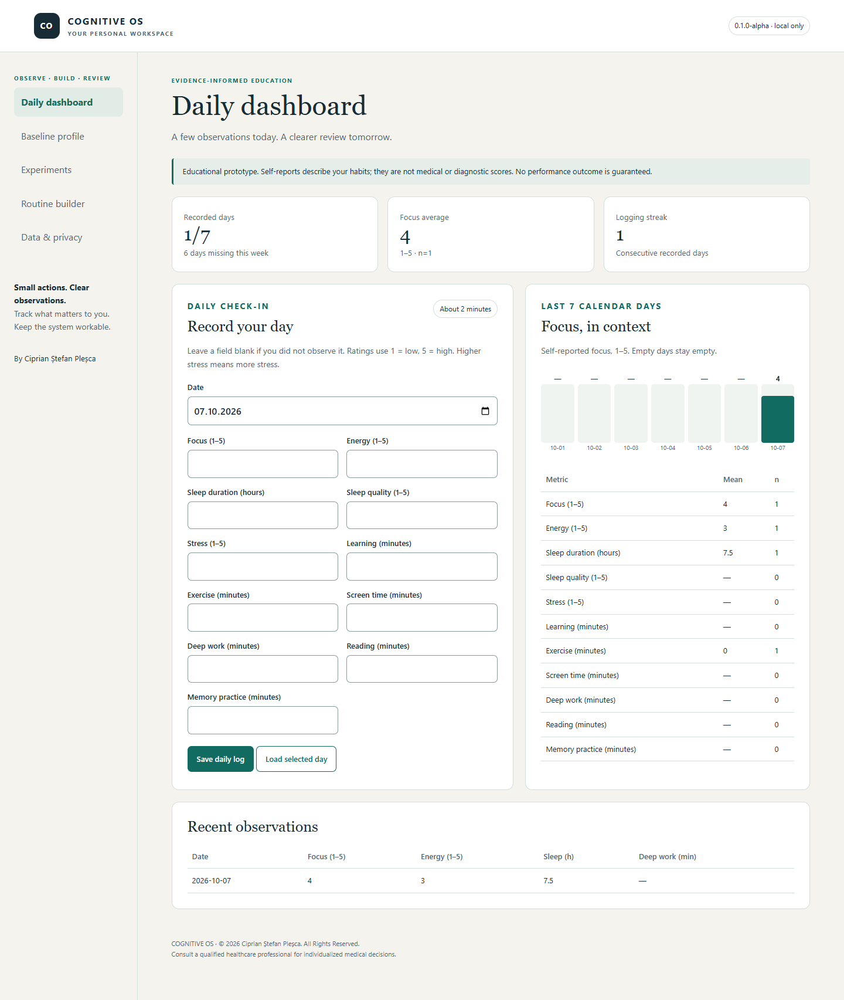
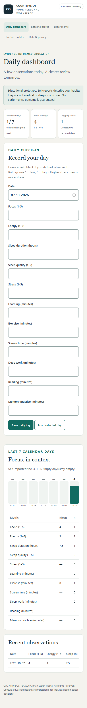

# Cognitive OS

**Evidence-Based Systems for Focus, Learning, Memory & Mental Performance**

Cognitive OS connects cognitive-science education with structured self-observation. It is a framework for understanding focus, learning, memory, sleep, recovery and everyday cognitive performance, with evidence review and local-first tools at its core.

  

## Current status

**Public repository: Research / Documentation Preview, 0.1.0-alpha.** This is the curated public surface: methodology, architecture, selected examples and prototype screenshots.

**Commercial development: v0.2.x Research Foundation development target.** The private product is unfinished. The complete guide, evidence library, worksheets and customer tools are developed separately; this repository is not a free copy of the paid edition or a finished commercial release.

Start with [getting started](docs/getting-started.md), the [project overview](docs/project-overview.md) or the [FAQ](docs/faq.md).

## Why Cognitive OS

A useful cognitive system needs two things: understandable evidence and a realistic way to act on it. Online information often places a replicated human finding beside a small exploratory study or an attractive speculation without explaining the difference.

Cognitive OS makes that distinction visible. An observation is not a diagnosis. A promising study is not a guarantee. A personal experiment is a way to review habits, not proof that an intervention caused a medical effect.

## Core areas

| Understand | Build | Review |
|---|---|---|
| Attention, focus, memory and learning | Workable practice and deep-work routines | Observations and missing data |
| Sleep, recovery and perceived stress | Accessible habits and digital boundaries | Feasibility and context |
| Exercise, nutrition and cognitive aging | Low-cost educational implementation | Evidence limits and uncertainty |

See the [cognitive-performance framework](docs/cognitive-performance-framework.md). Emerging technology is discussed as research, with established, promising, experimental and speculative claims kept distinct.

## Evidence system

| Grade | Evidence status |
|---|---|
| A | Strong evidence |
| B | Moderate evidence |
| C | Promising evidence |
| D | Mixed evidence |
| E | Limited evidence |
| F | Preclinical / indirect evidence |
| G | Speculative / insufficient evidence |

Grades describe evidence status and **must not be interpreted as medical recommendations**. Grade, confidence, population, outcome and limitations belong together. The internal A–G rubric is not a formal GRADE assessment. Unreviewed records have no assigned grade.

Read [evidence grading](EVIDENCE_GRADING.md) and [evidence methodology](docs/evidence-methodology.md). The public evidence-card example is a synthetic format demonstration, not an efficacy claim.

## Architecture

The diagram describes an editorial process, not a biological causal pathway. See [architecture](ARCHITECTURE.md) for the product layers and public/private boundary.

## Local-first privacy

The customer dashboard prototype is designed to keep observations in the user's browser. It has no backend, account, telemetry or remote requests. Browser storage is unencrypted, and clearing site data may erase records. Customers control exports and backups. Any future network feature must state what leaves the device before it is enabled.

This public repository collects no dashboard logs. GitHub itself has its own platform privacy practices. Read [privacy principles](docs/privacy-principles.md).

## Prototype screenshots

These screenshots contain invented demonstration observations, not customer data. They illustrate the private alpha interface; they do not imply clinical validation or a completed product.

## Roadmap

| Milestone | Product stage |
|---|---|
| 0.1 | Foundation and public documentation preview |
| 0.2 | Research Foundation: reviewed cards and substantive pilot chapters |
| 0.3–0.4 | Dashboard expansion and evidence engine |
| 0.5–0.6 | Workbook and commercial packaging |
| 0.7–0.8 | Scientific and product QA |
| 0.9 | Release candidate |
| 1.0 | Commercial release after all gates |

These are acceptance milestones, not promised dates. See [ROADMAP](ROADMAP.md) and [CHANGELOG](CHANGELOG.md).

## Research principles

No fabricated studies, authors, DOI, PMID or statistics. Prioritize relevant systematic reviews and meta-analyses while assessing their quality. Distinguish human from preclinical evidence, acknowledge scope and limitations, and preserve uncertainty. Original educational prose is independently authored; competitor products are not sources of text.

Read [research policy](RESEARCH_POLICY.md). Unverified claims are marked **UNVERIFIED — RESEARCH REQUIRED** and excluded from commercial benefit claims.

## Medical disclaimer

Cognitive OS is an educational project. It is **not medical advice** and does not diagnose, treat or cure medical or psychiatric conditions. It does not replace medication, psychotherapy or a clinician, or guarantee prevention of dementia. Consult an appropriately qualified healthcare professional for individualized medical decisions. See [DISCLAIMER](DISCLAIMER.md).

## Public and commercial editions

| Public GitHub | Private / local product |
|---|---|
| Documentation, methodology, architecture | Full research library and reviewed synthesis |
| Selected synthetic examples and screenshots | Complete master guide and paid worksheets |
| Public roadmap and contribution policies | Proprietary tools, build pipeline and customer deliverables |

There is no automatic mirror between them. Public visibility does not grant rights to redistribute the paid product. See [LICENSE](LICENSE.md).

## Participation

[Contributing](CONTRIBUTING.md) · [Code of conduct](CODE_OF_CONDUCT.md) · [Governance](GOVERNANCE.md) · [Security](SECURITY.md) · [Citation](CITATION.cff)

## Author

**Ciprian Ștefan Pleșca** — independent creator and researcher.

© 2026 Ciprian Ștefan Pleșca. All Rights Reserved where applicable. This project does not claim institutional affiliation, clinical accreditation or independent scientific certification.
