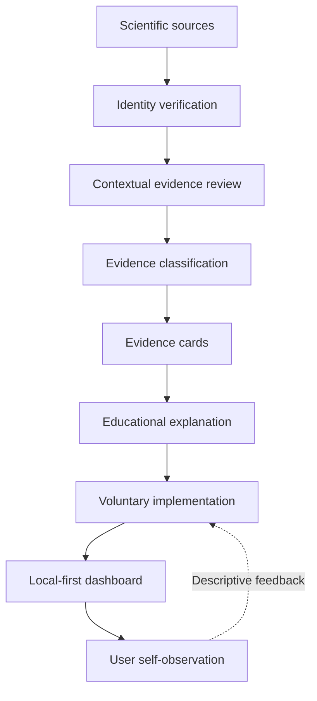

# Cognitive OS:

## An Evidence-Oriented Framework for Cognitive Performance, Learning, Self-Observation and Research Transparency

**Ciprian Ștefan Pleșca** · Independent Creator and Researcher · 2026

Public documentation edition 1.0.0. This is an authored framework paper, not a journal publication or an independently peer-reviewed article.

## Abstract

Cognitive-performance information often reaches readers as isolated advice, with little explanation of the populations, outcomes or uncertainty behind it. Cognitive OS proposes an educational and technical framework for making those distinctions visible. It connects source verification, contextual evidence classification, educational explanation, voluntary implementation and non-diagnostic self-observation. Evidence categories distinguish strong, moderate, promising, mixed, limited, indirect and insufficient support; confidence is documented separately rather than inferred from a letter. The framework uses bounded review of selected research and explicitly distinguishes this process from an exhaustive systematic review. Its software architecture favors browser-local observations, explicit exports and no mandatory account or server. Local storage supports user control but is unencrypted, dependent on browser behavior and vulnerable to accidental deletion. Personal comparisons are descriptive learning aids: they cannot establish causation, clinical efficacy or general applicability. This paper describes the conceptual layers, safety boundaries, reproducibility principles and limitations of the project. It presents design commitments and selected literature anchors rather than validation of the integrated system. Public documentation provides a traceable basis for criticism, technical discussion and possible future research, while unresolved questions remain visible. The project has not been clinically validated or independently peer-reviewed, and it does not provide individualized healthcare decisions.

## 1. Introduction

Advice about attention, memory and learning frequently crosses several domains without preserving their different research methods. A laboratory memory task, a classroom intervention and a self-reported work habit answer different questions. Combining their conclusions into a universal instruction can obscure uncertainty even when each cited study is real.

Cognitive OS addresses the organization and interpretation of that information. Its purpose is to make research questions, evidence boundaries and practical interpretations understandable together. The framework treats implementation as an educational translation that needs its own limits, rather than as a direct consequence of a citation. The selected literature on learning techniques illustrates why conditions and outcome measures matter [1]. The project is an independent documentation and software-design initiative; institutional affiliation and clinical accreditation are not claimed.

## 2. Problem Statement

The central problem is evidence flattening: different forms of support are presented as though they warrant the same conclusion. Replication, study quality, population relevance and directness can disappear behind a short recommendation. Hype-driven interpretation adds mechanism stories that may extend beyond measured outcomes. Missing uncertainty makes it difficult for a reader to tell whether a statement is established, preliminary or unresolved.

Learning tools can also be disconnected from implementation and review. A reader may understand a concept without a workable way to observe its relevance to an ordinary task. Conversely, a tracking interface may collect many values without clarifying what they mean. Behavioral records bring additional privacy concerns because ordinary logs can reveal routines, availability and subjective well-being. These problems motivate a framework that connects explanation with modest self-observation while avoiding diagnostic interpretation.

## 3. Design Objectives

The framework has seven objectives: evidence transparency, structured learning, practical implementation, local-first software, non-diagnostic observation, research traceability and modular architecture. Transparency means describing the question a source can answer and the conclusions it does not support. Traceability means preserving source identity, interpretive decisions and the documentation version in which a claim appears.

Structured learning should reduce unnecessary navigation, while modularity should allow a source correction without silently changing unrelated software behavior. Implementation remains voluntary and adaptable. A shorter practice, a different setting or choosing no action can be appropriate outcomes. Reproducibility concerns technical artifacts and editorial provenance; a reproducible build does not establish that the framework improves cognition.

## 4. Conceptual Architecture

The system separates research, evidence, educational, implementation, software and observation layers. A source first undergoes identity verification. Review then considers relevance and methodological limits. Classification summarizes that contextual appraisal, and an evidence card records the bounded statement. Educational components explain concepts; implementation frameworks translate them into feasible options. The dashboard records observations and returns descriptive feedback to the implementation layer.

The arrows describe information flow, not biological causation. Personal observations do not feed back into the evidence layer as proof. This separation prevents a favorable self-report from becoming an asserted scientific finding. The [architecture documentation](ARCHITECTURE.md) develops these interfaces and their limitations.

## 5. Evidence Classification Framework

The internal categories are A Strong, B Moderate, C Promising, D Mixed, E Limited, F Indirect and G Insufficient. Strong and moderate describe comparatively well-supported conclusions within their stated scope. Promising identifies preliminary support that needs further confirmation. Limited marks a narrow or weak basis for an inference. Mixed records inconsistency that cannot be adequately represented as merely a smaller number. Indirect covers evidence whose population, outcome or experimental setting does not directly answer the practical question, including preclinical work. Insufficient identifies a question for which support is not adequate for the proposed conclusion.

These are editorial categories, not a validated measurement scale, a formal GRADE assessment or a clinical recommendation system. Classification requires contextual judgment. Confidence separately describes how secure the appraisal is given coverage, source access and uncertainty. A synthesis may still be limited by the studies it includes. A well-identified citation does not establish that the interpretation is correct. The [evidence framework](EVIDENCE_GRADING.md) documents the category meanings and required accompanying information.

## 6. Educational Architecture

The conceptual components have different roles. A Master Guide supplies explanations and connections between domains. An Evidence Library supplies bounded statements with source links, confidence and limitations. An implementation program sequences practical reflection. Workbook concepts help record goals, context and review decisions. The dashboard supplies a descriptive observation interface.

These names identify system roles, not evidence that every component has been independently validated. The public repository explains the framework and selected examples; it does not contain an installable dashboard runtime or a complete intervention protocol. Educational design should preserve the distinction between a research result and an original organizational choice, such as a review schedule or worksheet heading.

## 7. Local-First Software Architecture

The documented dashboard design uses browser-local storage for ordinary observations. No mandatory cloud account or server is required for the conceptual runtime. JSON export supports restoration of structured records, while CSV represents tabular observations for inspection. Data ownership is approached through control over entry, retention and export rather than a promise that every platform behavior is controllable.

Browser storage and exported files are unencrypted. A shared browser profile may expose records; clearing site data or changing the file location or origin can separate or remove them. Private browsing and device loss introduce further limits. Users need explicit backup guidance, and future network features would require a new data-flow explanation. Reading documentation on GitHub itself involves GitHub's hosting practices. Local-first design must not be confused with absolute privacy or regulatory certification.

## 8. Self-Observation and N-of-1 Learning

Self-observation can help a person articulate a question and compare an ordinary baseline with a later period. A useful record states the task, units, dates, missing observations and relevant changes in context. It avoids converting an unrecorded value into zero. Baseline and follow-up summaries should describe their coverage rather than imply equal conditions when the periods differ.

The phrase N-of-1 learning is used here in an informal educational sense. The dashboard is not a clinical N-of-1 trial platform. Personal experiments lack the controls needed to isolate many alternative explanations: expectations, workload, measurement drift, concurrent changes and regression toward the mean can influence patterns. Association is not causation. A favorable comparison can justify further reflection, but it does not establish treatment efficacy or transfer a result to other people.

## 9. Safety and Ethical Boundaries

The framework is non-diagnostic. It supplies no medication instructions, disease-treatment protocols or personalized medical advice. Persistent health concerns and individualized healthcare decisions belong with appropriately qualified professionals. A research category or a dashboard trend cannot substitute for that relationship.

Ethical implementation also requires freedom to adapt or stop. Work intervals must accommodate caregiving, accessibility needs and necessary communications. Tracking should not become coercive optimization, workplace surveillance or a ranking of personal worth. The system should record uncertainty without punishing missing data. Risk communication should explain the boundary of an option rather than use reassurance to imply universal suitability.

## 10. Research Integrity

Citation integrity begins with verifiable authorship, title, year and persistent identifiers. DOI and PMID values must be copied from authoritative records, never generated to make an entry appear complete. Verification of a bibliographic record is distinct from reading the full paper, appraising its methods and independently reviewing an interpretation.

The present public framework uses selected research coverage. Source access and review scope must be stated; independent external review has not occurred. Versioning preserves the ability to identify which wording a reader encountered. Corrections should explain the affected claim and its downstream interpretations. Automated checks can detect missing fields or broken links, but cannot decide whether a study supports a practical conclusion.

## 11. Technical Reproducibility

Technical validation includes documentation structure, link integrity, diagram syntax, public-content boundaries and heuristic secret scanning. A version identifies the documentation edition. A content manifest makes publication scope inspectable. Hashes can show that a file is unchanged, and deterministic packaging can make repeated outputs comparable when inputs and build settings are fixed.

The public repository includes validation scripts for its own documentation. It does not disclose unrelated implementation internals or claim that its checks validate a clinical system. Browser and accessibility checks should identify the engines, viewports and methods actually used. Passing automation is evidence about those checks, not a complete security or usability guarantee.

## 12. Limitations

Cognitive OS is not a systematic review, clinically validated intervention, medical software system or independently peer-reviewed framework. Coverage is selective, and metadata or abstracts cannot replace complete study appraisal. The integrated architecture has not been shown to improve cognitive performance. Claims in this paper concern design and documented boundaries, not measured efficacy.

Self-report is sensitive to expectations and inconsistent interpretation. Generalizability depends on populations, tasks and settings. Browser-local records can be lost, exports remain readable to anyone with access, and software accessibility requires testing beyond automated rules. Selected learning, sleep and activity references [1–4] anchor domain discussion; none validates the Cognitive OS framework as a whole.

## 13. Future Work

Possible directions include broader source coverage, explicit full-text appraisal, independent academic review, improved accessibility, better portability and stronger optional privacy controls. Additional educational modules could be developed after their evidence and safety boundaries are documented. Longitudinal self-observation might support methodological questions about missingness and usability, with appropriate consent and governance if research involving people is proposed.

These directions are research possibilities, not promised features or delivery dates. Collaborations should define the question, responsibilities, data handling and publication rights before collecting records. Independent criticism is valuable even when it leads to narrower claims rather than additional functionality.

## 14. Conclusion

Cognitive OS organizes evidence, explanation and descriptive observation into separate but connected layers. Its central commitment is that source identity, uncertainty and implementation limits remain visible throughout that translation. Public documentation provides a basis for examining the framework while technical reproducibility and scientific validation remain distinct responsibilities.

## References

The following public records were checked for bibliographic identity and abstract-level scope on 2026-10-08. They are selected literature anchors, not an exhaustive bibliography or a claim of full-text appraisal.

1. Dunlosky, J., Rawson, K. A., Marsh, E. J., Nathan, M. J., & Willingham, D. T. (2013). Improving students' learning with effective learning techniques: Promising directions from cognitive and educational psychology. *Psychological Science in the Public Interest, 14*(1), 4–58. DOI: 10.1177/1529100612453266. [PubMed record](https://pubmed.ncbi.nlm.nih.gov/26173288/).
2. Cepeda, N. J., Pashler, H., Vul, E., Wixted, J. T., & Rohrer, D. (2006). Distributed practice in verbal recall tasks: A review and quantitative synthesis. *Psychological Bulletin, 132*(3), 354–380. DOI: 10.1037/0033-2909.132.3.354. [PubMed record](https://pubmed.ncbi.nlm.nih.gov/16719566/).
3. Lim, J., & Dinges, D. F. (2010). A meta-analysis of the impact of short-term sleep deprivation on cognitive variables. *Psychological Bulletin, 136*(3), 375–389. DOI: 10.1037/a0018883. [PubMed record](https://pubmed.ncbi.nlm.nih.gov/20438143/).
4. Northey, J. M., Cherbuin, N., Pumpa, K. L., Smee, D. J., & Rattray, B. (2018). Exercise interventions for cognitive function in adults older than 50: A systematic review with meta-analysis. *British Journal of Sports Medicine, 52*(3), 154–160. DOI: 10.1136/bjsports-2016-096587. [PubMed record](https://pubmed.ncbi.nlm.nih.gov/28438770/).
