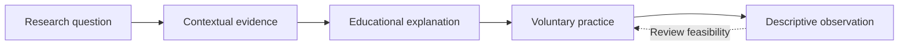

# Overview

## Motivation and scope

Cognitive OS organizes cognitive-performance information into an educational framework with explicit research and software boundaries. The motivation is not that every domain lacks evidence. It is that findings can lose their scope as they move into everyday advice. A source concerning one memory task may be presented as a conclusion about all learning; a correlation between routines and well-being may be presented as an instruction that will benefit everyone. The project makes those translation steps inspectable.

Its scope includes attention, focus, memory, learning, sleep, movement, perceived stress and recovery, habits, the digital environment and research on cognitive aging. These domains overlap, but they are not one measured ability. The framework avoids a single brain score and does not label a person as cognitively healthy or impaired from a diary. Describing a domain also does not mean that every proposed practice within it has adequate support.

## An educational and technical framework

The educational layer explains a bounded finding and the questions it leaves open. The implementation layer offers a way to think about ordinary decisions, such as defining an observable task or reviewing an interruption pattern. The software layer records self-selected observations and supports export. Each layer has a different responsibility, and none can borrow validation from the layer before it without additional evidence.

This overview is a flow of information. It is not a model of neural causation. The feedback arrow permits a person to revise their plan; it does not turn their observations into proof of the original research claim. That distinction is central to the project's educational philosophy.

## What a reader can learn here

A reader can examine the category meanings, the review process, the interfaces between components and the privacy assumptions of a local-first design. The Whitepaper supplies a longer argument. Domain pages show how to preserve uncertainty when discussing learning, interruptions, sleep or physical activity. Architecture and testing pages explain how documentation integrity differs from functional, scientific and clinical validation.

The repository does not contain an installable dashboard runtime. Screenshots are historical interface illustrations using synthetic observations. A picture of a chart establishes neither a real participant result nor current behavior on every device. The source-controlled documentation can be read without creating an account or supplying personal records, although GitHub itself applies its own hosting and privacy practices.

## What the project does not establish

Cognitive OS has not been clinically validated or independently peer-reviewed. Its selected source coverage is not an exhaustive systematic review. It does not provide medication instructions, treatment protocols or personalized medical decisions. The internal evidence categories are not a formal GRADE assessment, and a category is not a recommendation to act.

Personal reflection may identify a practical question worth revisiting. It cannot isolate causation when workload, expectations, task difficulty and other factors change together. A useful observation can remain useful without being promoted into an efficacy claim. The project also treats opting out, adapting a practice or asking for appropriate support as legitimate choices.

## Reading responsibly

Read Evidence Framework together with Research Methodology so that a category is not mistaken for a complete appraisal. Read Local-First Dashboard and Privacy before keeping any observations, because local storage is unencrypted and can be lost. Use Safety and Ethical Boundaries to understand why ordinary educational examples must not become healthcare instructions. Roadmap and Future Research records possible extensions without presenting them as existing features.

The framework remains open to narrower interpretations and corrections. A clear limitation is more informative than a confident but unsupported promise. Public documentation is the canonical place to inspect those commitments and their revisions.

## Navigation and attribution

[Wiki Home](https://github.com/Ciprian-LocalPulse/cognitive-os/blob/main/wiki-export/Home.md) · [Whitepaper](https://github.com/Ciprian-LocalPulse/cognitive-os/blob/main/WHITEPAPER.md) · [Documentation](https://github.com/Ciprian-LocalPulse/cognitive-os/blob/main/docs/README.md)

© 2026 Ciprian Ștefan Pleșca. Educational and informational use; not medical advice.

[Documentation index](README.md) · [Expanded Wiki discussion](https://github.com/Ciprian-LocalPulse/cognitive-os/blob/main/wiki-export/Introduction-to-Cognitive-OS.md)
