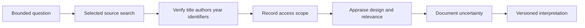

# Research methodology

## Review scope

Cognitive OS uses a bounded, question-led review of selected literature. It does not claim an exhaustive systematic review, a registered protocol or complete study-level risk-of-bias assessment. The current public framework has not been independently peer-reviewed. Method descriptions distinguish the intended review process from what has actually been examined, because a planned method is not evidence that every step has been completed.

A useful question identifies a population, an activity or exposure, a comparison where relevant and a measured outcome. Questions about immediate task performance differ from questions about long-term retention or everyday functioning. A review should record that distinction before searching, so that an appealing mechanism or broad title does not substitute for a relevant endpoint.

## Source types and their limits

Systematic reviews and meta-analyses can organize a field, but their credibility depends on the search, included studies, appraisal and synthesis. Pooling does not remove bias or make different outcomes interchangeable. Randomized controlled trials can support causal inference within their design, with attention to allocation, attrition, measurement and applicability. Small or selective trials do not automatically establish broad benefit.

Observational research can describe associations and real-world variation. Confounding, selection and reverse direction remain important alternative explanations. Preclinical work can support a mechanistic hypothesis while remaining indirect for everyday human practice. Official sources are useful for stable bibliographic identities and institutional guidance, but an authoritative host does not guarantee that every inference a reader makes from a record is valid.

## Verification and appraisal

Verification checks title, authorship, year and identifiers against a publisher or authoritative bibliographic record. DOI and PMID values must never be fabricated. Access scope should say whether metadata, an abstract or full text was reviewed. Abstracts are useful for orientation, but cannot support a claim that the full methods or all reported results were appraised.

Appraisal asks whether the source answers the defined question, how outcomes were measured and what the design cannot establish. It should record relevant limitations without borrowing certainty from the source type alone. Evidence category and confidence follow this contextual judgment; the workflow does not assign a letter automatically from the presence of a meta-analysis or trial.

## Selected literature anchors

The public Whitepaper links verified records for learning techniques, distributed practice, sleep deprivation and exercise research. These records orient the domain discussion and illustrate differences in population, task and outcome. They do not validate Cognitive OS as an integrated system. The reference list states bibliographic and abstract-level verification rather than claiming exhaustive full-text appraisal.

When several pages discuss the same reference, the repetition is a navigation aid rather than independent corroboration. A claim should not acquire apparent strength simply because it appears in more than one document. Novel questions require additional sources and their own appraisal rather than extension by analogy alone.

## Version review and corrections

Interpretations should be revisited when corrections, retractions, contradictory findings or material applicability concerns arise. A scheduled review can support maintenance, but it cannot guarantee immediate awareness of every change. Documentation revisions should identify affected conclusions and retain the limits of the new review.

Contributors can help by providing a verified record, the precise disputed wording and a suggested interpretation. Review records must separate automated prechecks, editorial source verification and independent human assessment. Transparency about incomplete work is preferable to implying scientific approval from a successful technical check. The Evidence Framework page explains how these decisions are communicated to readers.

## Navigation and attribution

[Wiki Home](https://github.com/Ciprian-LocalPulse/cognitive-os/blob/main/wiki-export/Home.md) · [Whitepaper](https://github.com/Ciprian-LocalPulse/cognitive-os/blob/main/WHITEPAPER.md) · [Documentation](https://github.com/Ciprian-LocalPulse/cognitive-os/blob/main/docs/README.md)

© 2026 Ciprian Ștefan Pleșca. Educational and informational use; not medical advice.

[Documentation index](README.md) · [Expanded Wiki discussion](https://github.com/Ciprian-LocalPulse/cognitive-os/blob/main/wiki-export/Research-Methodology.md)
