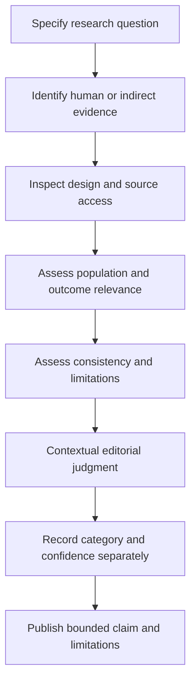

# Evidence system

## Categories and interpretation

The A–G framework is an internal editorial vocabulary for discussing the status of a bounded claim. It is not a validated scale, a formal GRADE assessment or an automated recommendation engine. A category is meaningful only alongside the question, population, outcome and review limits. The same publication can be direct evidence for one question and indirect evidence for another.

| Category | Meaning | Interpretation boundary |
|---|---|---|
| A Strong | Substantial, comparatively consistent support within scope | Does not establish universal benefit |
| B Moderate | Meaningful support with material remaining limitations | Applicability still requires context |
| C Promising | Preliminary support worth further investigation | Confirmation is still needed |
| D Mixed | Inconsistent results or unresolved differences | Is not merely a smaller effect |
| E Limited | Narrow or weak support for the question | Avoid broad extrapolation |
| F Indirect | Evidence does not directly address the practical question | Includes relevant preclinical or proxy evidence |
| G Insufficient | Support is inadequate for the proposed conclusion | Speculation must stay labeled |

## Why the letters are not a linear ranking

The categories describe several dimensions. Mixed evidence concerns inconsistency, while indirect evidence concerns the distance between a study and the question. Insufficient evidence concerns whether a conclusion is supportable at all. Reducing these dimensions to a numerical score would lose the reason for uncertainty. A letter therefore cannot be used as an interval measurement or averaged across unrelated claims.

Confidence is separate. It describes how secure the appraisal is given source access, coverage, methodological clarity and unresolved questions. A narrowly scoped finding can be well understood while having limited practical reach. Conversely, a broad body of research can remain difficult to interpret if outcomes or populations differ substantially. Risk and recommendation are also separate from both category and confidence.

## A contextual decision process

This flow does not automatically assign categories from study labels. An RCT can have serious limitations; a synthesis can combine weak studies; an observational design may be appropriate for a descriptive question. Expert interpretation and source-specific appraisal are necessary. The diagram communicates tasks to consider rather than a decision rule that guarantees a valid grade.

## Information that travels with a category

An evidence statement should identify the population studied, the measured outcome, the relevant comparison and the limits of available source access. It should explain whether the finding is associative or supports a causal inference within its original design. It should distinguish direct results from an educational translation, and it should retain risks or feasibility limits when those matter to interpretation.

Verification status also travels with the statement. Bibliographic identity, abstract-level review, full-text appraisal and independent review are different stages. Neither a complete citation nor automated field validation should be described as independent scientific approval. The current framework has not undergone independent external peer review.

## Corrections and unresolved claims

If a source is corrected, retracted or materially contradicted, the affected claim needs reassessment. The documentation should identify what changed and whether downstream explanation still holds. An unresolved record should remain unresolved; it should not receive a favorable category merely because a page requires a badge.

Readers can propose a correction by identifying the exact statement, source and mismatch. The aim is a defensible interpretation, even if the result is narrower or less actionable. Category transparency supports that discussion, but does not turn the overall framework into clinically validated guidance. See Research Methodology for source selection and Safety and Ethical Boundaries for the limits of implementation.

## Navigation and attribution

[Wiki Home](https://github.com/Ciprian-LocalPulse/cognitive-os/blob/main/wiki-export/Home.md) · [Whitepaper](https://github.com/Ciprian-LocalPulse/cognitive-os/blob/main/WHITEPAPER.md) · [Documentation](https://github.com/Ciprian-LocalPulse/cognitive-os/blob/main/docs/README.md)

© 2026 Ciprian Ștefan Pleșca. Educational and informational use; not medical advice.

[Documentation index](README.md) · [Expanded Wiki discussion](https://github.com/Ciprian-LocalPulse/cognitive-os/blob/main/wiki-export/Evidence-Framework.md)
