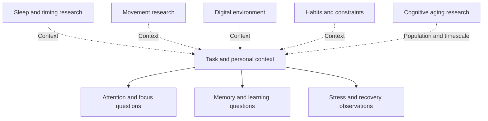

# Cognitive framework

## Domains without a single score

Cognitive OS treats cognitive performance as a set of task-dependent domains influenced by context. Attention concerns what information receives priority. Focus concerns maintaining a chosen task. Memory concerns retaining and accessing information, while learning concerns changes in what can be understood or performed. These concepts overlap, but they cannot be reduced to one diary rating or a universal measure of brain function.

Sleep, movement, stress and recovery, habits and the digital environment supply context for these domains. Research on cognitive aging adds questions about populations and time scales that differ from immediate work performance. The framework maps these relationships to organize inquiry. It does not infer a disease state, a prevention guarantee or a mechanism from a person's ordinary records.

The map groups questions. Dotted connections indicate relevance to inquiry, not demonstrated causal pathways. It deliberately avoids an arrow claiming that a lifestyle change produces a particular cognitive or medical outcome.

## Distinguishing outcomes

Laboratory attention tasks, recall tests, classroom outcomes and self-reported work quality measure different things. Improvement in one endpoint does not establish improvement in every other domain. A general statement about cognitive performance should therefore identify the actual measure and setting. Even the same word, such as focus, can refer to a subjective rating, sustained attention in a task or completion of an intended deliverable.

A useful observation names the task and records units where appropriate. A rating can support reflection on perceived experience, but cannot replace objective assessment. Minutes spent learning describe time rather than retention. A completed work interval describes a schedule rather than output quality. These differences are central when choosing what to record.

## Educational connections

The Learning and Memory page separates encoding, retrieval, feedback and retention. Focus, Attention and Deep Work discusses interruption and reorientation without claiming a universal cost per interruption. Sleep, Recovery and Circadian Factors separates sleep opportunity from measured sleep and daytime function. Physical Activity and Cognitive Research distinguishes research on cognitive tests from claims about personal disease prevention.

Habit and digital-environment concepts concern feasibility as well as outcomes. An interface can make an ordinary behavior easier to begin, but that observation is not a complete theory of neural learning. A planned communication window can reduce optional checking in one setting while being unsuitable in a role requiring immediate responsiveness. Context remains part of interpretation.

## Healthy aging and generalizability

Research involving older adults needs its population boundary preserved. Findings from selected exercise trials should not be generalized to all ages, every activity or long-term disease outcomes. Cognitive aging is a research domain in this framework, not a diagnosis derived from logs. The selected activity reference in the Whitepaper is an entry point for understanding this distinction, not a personal prescription.

## Using the framework

Begin with a bounded question, inspect the relevant evidence limits and select an observation that can answer a modest practical question. Preserve missingness and changes in context. Review whether a practice is feasible before interpreting patterns. A decision to adapt or stop can be reasonable even when the general research is promising.

The framework's integration is organizational. It has not been shown to improve cognitive performance as a whole. Connecting several domains in documentation makes their relationships discussable; it does not combine their uncertainties into a validated intervention. Safety, privacy and research integrity apply throughout the map.

## Navigation and attribution

[Wiki Home](https://github.com/Ciprian-LocalPulse/cognitive-os/blob/main/wiki-export/Home.md) · [Whitepaper](https://github.com/Ciprian-LocalPulse/cognitive-os/blob/main/WHITEPAPER.md) · [Documentation](https://github.com/Ciprian-LocalPulse/cognitive-os/blob/main/docs/README.md)

© 2026 Ciprian Ștefan Pleșca. Educational and informational use; not medical advice.

[Documentation index](README.md) · [Expanded Wiki discussion](https://github.com/Ciprian-LocalPulse/cognitive-os/blob/main/wiki-export/Cognitive-Performance-Framework.md)
