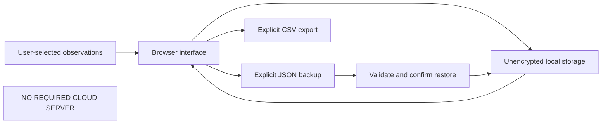

# Local-first privacy

## Philosophy and documented scope

Local-first design gives ordinary records a home on the user's device and makes exports an explicit choice. Cognitive OS documents a browser-local observation interface without a mandatory account or cloud server. This is an architectural preference, not a claim that local files are automatically secure or that every browser behaves identically. The public repository contains documentation and selected interface illustrations, not an installable dashboard runtime.

Data ownership is expressed through control over entry, review, export and deletion. It also requires understandable limits. A person cannot make an informed storage choice if the interface says only that data is private without explaining profile access, browser clearing or the readability of exported files.

## Browser storage limits

Browser-local storage belongs to a browser profile and origin. Clearing site data, changing browsers, moving a file or using private browsing can remove or separate records. Device failure and profile corruption introduce additional loss risks. Local storage is not an encrypted vault, and another person with access to the same profile may be able to inspect the data.

Ordinary logs can reveal routines, availability and subjective experience. A record need not contain a diagnosis to be sensitive. The framework therefore favors minimal entries relevant to the person's question and discourages storing detailed medical information. Retention should be a deliberate choice rather than an accumulation of every possible metric.

## Export and restoration

JSON export is intended to preserve structured records for restoration. CSV represents tabular observations for inspection and should not be described as a complete replacement for every module's backup. Users need to know the export's scope, units and missing-value conventions. A downloaded file remains on the device after deleting browser records unless it is separately removed.

Import is a validation boundary. A malformed file should be rejected before changing valid records, and replacement should require clear confirmation. Restoration cannot recover observations that were never exported. Backups should be kept in a location the user controls, with awareness that the files are unencrypted and can be read by someone who obtains them.

## Privacy is more than no telemetry

A runtime with no automatic outbound requests reduces one data-flow concern, but does not eliminate device, profile, backup or sharing risks. Opening source links is an explicit external interaction. Reading public documentation on GitHub also involves that platform's infrastructure. These activities should not be confused with automatic transmission of observation records.

Future networking or synchronization would require a new data-flow description, clear consent and updated validation. Such features are possibilities, not implemented commitments in this public documentation edition. The project makes no blanket privacy, security or regulatory-compliance certification.

## Practical review questions

Before keeping records, consider who can access the device and browser profile, which observations are necessary, how long to retain them and whether a current JSON backup exists. Before changing file location or browser origin, preserve an export. When requesting support, use a synthetic example rather than a full personal record.

Security reports and public issues must not contain credentials, health details or another person's observations. The Security policy explains reporting channels. A local-first architecture is valuable only when the limitations and responsibilities are as visible as the convenience of offline use.

## Navigation and attribution

[Wiki Home](https://github.com/Ciprian-LocalPulse/cognitive-os/blob/main/wiki-export/Home.md) · [Whitepaper](https://github.com/Ciprian-LocalPulse/cognitive-os/blob/main/WHITEPAPER.md) · [Documentation](https://github.com/Ciprian-LocalPulse/cognitive-os/blob/main/docs/README.md)

© 2026 Ciprian Ștefan Pleșca. Educational and informational use; not medical advice.

[Documentation index](README.md) · [Expanded Wiki discussion](https://github.com/Ciprian-LocalPulse/cognitive-os/blob/main/wiki-export/Local-First-Dashboard-and-Privacy.md)
