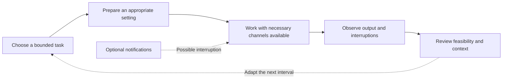

# Focus, Attention and Deep Work

## Different meanings of focus

Attention concerns prioritizing information, while focus in ordinary work concerns maintaining a chosen task and recognizing when attention has moved elsewhere. Deep work is treated here as an organizational label for protected task engagement. It is not a clinical construct or a validated cognitive dose. A scheduled block can support planning without proving that a particular duration improves cognition.

The distinction matters because interfaces often record minutes and interpret them as performance. Time at a desk, time in an application and completion of an intended output are different measures. A person can spend a short interval resolving an important question or a long interval repeating an unproductive action. The framework encourages a task-specific observation rather than a universal productivity score.

## Switching and reorientation

Task switching involves moving between task demands. Context switching can also require reconstructing what was being done, why and what remains unresolved. A notification may become an interruption, but its significance depends on the task and role. The framework does not attach an invented percentage penalty or a fixed recovery time to every interruption.

Some interruptions are necessary. Caregiving, safety communications, collaborative work and accessibility support can take priority over a planned interval. Reducing optional alerts should not make a person unreachable when their responsibilities require responsiveness. Productivity absolutism would replace practical judgment with a rigid rule; that is outside the educational intent of this framework.

## Environment and voluntary controls

An appropriate environment can include a clear next step, needed materials and an agreed communication boundary. These are planning concepts, not claims that an ideal workspace guarantees focus. A quiet setting may be unavailable, and working preferences or accessibility needs can differ. The relevant question is whether a change is feasible and what ordinary observation might help review it.

Planned communication windows are one possible organizational choice. They should preserve urgent channels and be adapted to the role. Phone placement, optional notification settings and workspace preparation are examples of changing the environment, not complete explanations of attention or habit neuroscience. No specific configuration is presented as universally optimal.

## Protected intervals and observation

A protected interval can be defined by an intended deliverable rather than a branded timer length. An observation can record whether the task was completed, partially completed or interrupted, alongside the context. Minutes and interruption counts should remain separate. An unrecorded interruption count should not become zero, and an estimated interval should remain labeled as an estimate.

Comparisons across days are descriptive. Different tasks, deadlines, sleep, expectations and collaboration demands can explain changes in output. A favorable week after reducing alerts does not isolate the effect of the alerts. Personal reflection can still identify a workable arrangement without claiming causal proof.

## Safety and limits

The page supplies no diagnosis of attention difficulties and no treatment recommendation. Persistent problems affecting daily functioning belong with appropriately qualified professionals. Ordinary work planning must remain compatible with rest, nourishment, accessibility and personal obligations.

The overall framework is not independently validated. This conceptual pathway demonstrates how to keep task choices, observations and interpretations separate. Research Methodology explains how a future source-specific claim would be checked, and Self-Observation and Personal Experiments explains the limits of baseline and follow-up comparisons.

## Navigation and attribution

[Wiki Home](https://github.com/Ciprian-LocalPulse/cognitive-os/blob/main/wiki-export/Home.md) · [Whitepaper](https://github.com/Ciprian-LocalPulse/cognitive-os/blob/main/WHITEPAPER.md) · [Documentation](https://github.com/Ciprian-LocalPulse/cognitive-os/blob/main/docs/README.md)

© 2026 Ciprian Ștefan Pleșca. Educational and informational use; not medical advice.
