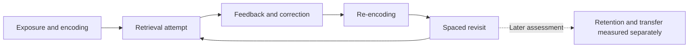

# Learning and Memory

## Processes and outcomes

Learning and memory are related but not identical concepts. Encoding concerns how information is initially represented in a learning situation. Retrieval concerns accessing it later. Retention concerns what remains available over time, while transfer concerns use in another task or setting. A successful immediate response does not necessarily establish durable retention or broad transfer. The framework keeps these outcomes separate when discussing a learning practice.

Working memory concerns the limited, context-dependent handling of information during a task. Long-term knowledge can support interpretation and reduce some task demands, but memory capacity is not represented here as a fixed universal number. An educational diagram simplifies interactions; it should not be mistaken for a complete neural model or a diagnostic assessment.

## Retrieval and feedback

A retrieval attempt makes the availability of information observable. It should be distinguished from rereading an answer and experiencing familiarity. Feedback can identify an error or a gap and inform the next attempt. Neither a confident answer nor a smooth practice session proves that the material will be available later. The intended outcome and the timing of assessment remain important.

The framework discusses retrieval as an educational strategy, not a guarantee that every recall exercise is suitable. Task difficulty, prior knowledge, accessibility and emotional context can affect feasibility. An ordinary learning activity can be shortened, supported or changed when frustration interferes with understanding. Practice should not become a high-stakes self-test that assigns a judgment about intelligence.

## Spacing and interleaving

Distributed practice concerns separating learning opportunities in time. The selected synthesis by Cepeda and colleagues addresses verbal recall tasks, so its scope must not be expanded to every motor, professional or creative skill. It does not provide a universally optimal schedule for every learner and retention goal. The Whitepaper links the verified bibliographic record and states the review scope.

Interleaving concerns the arrangement of different materials or problem types. It is distinct from simply studying on multiple days. Its value depends on what needs to be discriminated and how practice relates to the assessment. The selected review by Dunlosky and colleagues is an orientation to techniques and conditions; this Wiki does not infer a fixed rule for all subjects from that review.

## Recording a learning question

A modest record might name the material, note the practice method and describe what could be recalled at a later review. Time spent and subjective confidence should remain separate from correctness. Missing checks should remain missing rather than count as failed recall. If the assessment changes, the new observations should not be presented as directly comparable without explanation.

Baseline and follow-up records can help identify questions, but concurrent changes in study material, workload or prior knowledge complicate interpretation. A higher rating after using a technique cannot establish that the technique caused the improvement. The purpose is educational reflection rather than clinical experimentation or a controlled learning-science trial.

## Limits and sources

This page describes a conceptual framework with selected literature anchors, not a complete review of memory science. It does not diagnose memory difficulties or recommend medical treatment. Persistent concerns require appropriate professional assessment rather than interpretation from a dashboard.

See the Whitepaper references for Dunlosky et al. and Cepeda et al., and Research Methodology for the distinction between bibliographic verification, abstract-level review and full-text appraisal. Evidence categories summarize a bounded interpretation; they do not erase the conditions under which a finding was obtained.

## Navigation and attribution

[Wiki Home](https://github.com/Ciprian-LocalPulse/cognitive-os/blob/main/wiki-export/Home.md) · [Whitepaper](https://github.com/Ciprian-LocalPulse/cognitive-os/blob/main/WHITEPAPER.md) · [Documentation](https://github.com/Ciprian-LocalPulse/cognitive-os/blob/main/docs/README.md)

© 2026 Ciprian Ștefan Pleșca. Educational and informational use; not medical advice.
