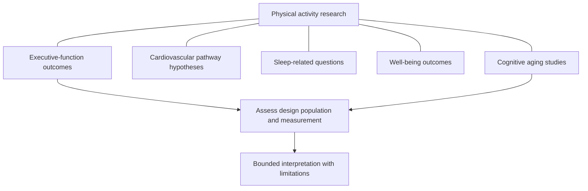

# Physical Activity and Cognitive Research

## Research domains and applicability

Physical activity is connected to several research questions, including cognitive test performance, cardiovascular function, sleep, well-being and aging. Those domains are related but not interchangeable. A study measuring an executive-function task does not directly establish an effect on every aspect of everyday cognition. A proposed cardiovascular mechanism does not establish a personal treatment outcome.

Cognitive OS uses an evidence map to keep these questions visible. The map does not assign an exercise dose, promise disease prevention or imply that the whole framework is an effective intervention. Any practical interpretation requires attention to the studied population, activity, comparison, duration and outcome.

The undirected connections identify fields of inquiry rather than causal pathways. Hypothesized mechanisms and observed outcomes remain separate. The assessment step prevents the existence of several related topics from becoming an asserted universal benefit.

## Trials, associations and mechanisms

Intervention trials can examine selected activity programs under particular conditions. Their interpretation depends on allocation, measurement, adherence, attrition and the comparison group. Observational studies can examine patterns in ordinary life but remain vulnerable to confounding and reverse direction. Mechanistic work can suggest a pathway without answering whether a specific educational practice changes a relevant human outcome.

Cardiovascular pathways are therefore presented as research hypotheses or domains, not guaranteed explanations. Sleep and well-being outcomes require their own definitions and sources. Improvements in one measure should not be assumed to explain changes in another unless the research directly examines that relationship.

## The selected activity reference

The Whitepaper includes Northey and colleagues' systematic review with meta-analysis of exercise interventions and cognitive function in adults older than fifty. Its bibliographic record and abstract-level scope were verified. The population boundary matters: the reference does not establish an identical result for every age, ability, activity or setting. This page does not translate the review into an individual exercise prescription.

A synthesis can identify patterns while retaining limitations from included trials and outcome measures. It cannot validate Cognitive OS as a system because that framework was not the intervention studied. It also cannot make a dashboard diary into a disease-prevention measure. Those would be separate research questions requiring appropriate designs.

## Ordinary self-observation

A person may record an ordinary activity and describe its context or feasibility. Activity minutes are not an adequate representation of intensity, accessibility, enjoyment or recovery. Perceived energy and cognitive task outcomes should remain separate. An estimated value should stay labeled as estimated, and missing activity records should not be converted to inactivity.

Personal comparisons can be influenced by workload, expectations, sleep and concurrent changes. A favorable rating after activity is an association in the record, not proof that the activity caused a cognitive benefit. The educational purpose is to refine a question and review what is workable.

## Safety and healthy aging

The framework gives no disease-prevention guarantee, treatment protocol or personalized exercise instruction. Injury, symptoms, medical restrictions and questions about appropriate activity require qualified professional guidance. Accessibility and individual circumstances are part of feasibility, not exceptions to an idealized routine.

Healthy cognitive aging remains a research domain. This page does not infer aging status or dementia risk from a log. Research Methodology explains the review boundaries, while Safety and Ethical Boundaries explains why evidence communication must not become individualized healthcare advice.

## Navigation and attribution

[Wiki Home](https://github.com/Ciprian-LocalPulse/cognitive-os/blob/main/wiki-export/Home.md) · [Whitepaper](https://github.com/Ciprian-LocalPulse/cognitive-os/blob/main/WHITEPAPER.md) · [Documentation](https://github.com/Ciprian-LocalPulse/cognitive-os/blob/main/docs/README.md)

© 2026 Ciprian Ștefan Pleșca. Educational and informational use; not medical advice.
