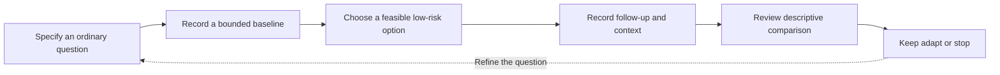

# Self-Observation and Personal Experiments

## Purpose and terminology

Self-observation means recording a bounded aspect of ordinary activity so that a person can review it later. It can clarify a task, identify missing information and support reflection on feasibility. It is not a diagnostic assessment. A personal experiment in this framework is an informal educational comparison, not a clinical trial or permission to alter treatment.

The phrase N-of-1 learning names the personal scope of the reflection. It does not imply that the dashboard implements randomized, blinded or clinically supervised N-of-1 methodology. Those methods require additional design and governance. A simple before-and-after comparison cannot borrow their causal strength.

## Baseline and follow-up

A baseline is a reference period, not a perfect representation of a person's usual state. Its duration, task mix and coverage should be visible. Follow-up may differ in workload, deadlines, prior knowledge or available time. A comparison is informative only to the extent that the observations and their units are understandable.

Define what will be recorded before interpreting a result. Minutes, subjective ratings, task completion and correctness answer different questions. A change in the meaning of a rating can produce an apparent trend without a corresponding change in the activity. Estimates should remain labeled, and an uncertain value should not be treated as precise merely because it appears in a table.

## Missingness and self-report

Missing observations are not zeros. Zero minutes of an activity is an observed value; no record supplies no such information. Missingness can be patterned: difficult or busy days may be less likely to be recorded. A summary of the available days can therefore differ from the whole period's experience. Reporting the number of observations and missing days helps expose that limitation.

Self-report is affected by recall, expectations and interpretation. Knowing that a change was intended to help can influence a subjective rating. The framework does not correct those effects by relabeling the result objective. It keeps the source of the observation explicit and limits the conclusion accordingly.

## Association and causation

An association in a personal log shows that recorded values varied together within the observed period. It does not isolate an explanation. Workload, sleep, task difficulty, concurrent changes, selection and regression toward the mean can account for patterns. Repeated favorable observations may justify a clearer question, but do not alone establish a treatment effect.

An educational comparison should describe what happened and what else changed. Avoid statements that a routine caused improved memory or prevented a health condition. The evidence category of a published finding should not be upgraded because a diary appears consistent with it. Personal feedback returns to implementation choices, not scientific proof.

## Ethical implementation

The chosen option should remain voluntary, adaptable and compatible with necessary responsibilities. Stop or seek appropriate support if observation becomes distressing, coercive or intrusive. No medication changes, disease-treatment decisions or high-risk self-experiments are part of this framework.

Records remain under the user's control in the documented local-first design, but browser storage and exported files are unencrypted. Read Local-First Dashboard and Privacy before recording sensitive patterns. A useful outcome may be a smaller plan, a different measure or deciding not to continue tracking; success is not defined as an ever-growing dataset.

## Navigation and attribution

[Wiki Home](https://github.com/Ciprian-LocalPulse/cognitive-os/blob/main/wiki-export/Home.md) · [Whitepaper](https://github.com/Ciprian-LocalPulse/cognitive-os/blob/main/WHITEPAPER.md) · [Documentation](https://github.com/Ciprian-LocalPulse/cognitive-os/blob/main/docs/README.md)

© 2026 Ciprian Ștefan Pleșca. Educational and informational use; not medical advice.
