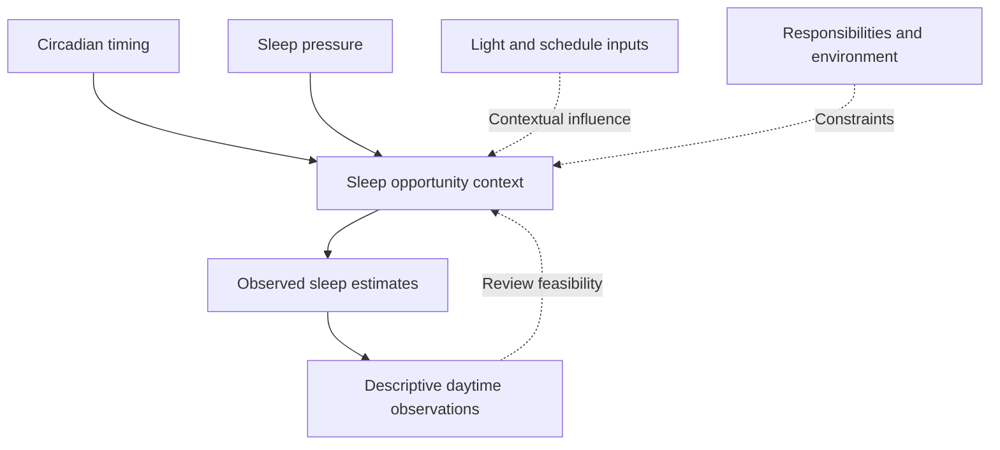

# Sleep, Recovery and Circadian Factors

## An educational model

Sleep and daytime function are discussed as research domains and everyday contexts, not as medical treatment targets. Sleep opportunity refers to the time and circumstances available for sleep. It is distinct from measured sleep duration, sleep quality and clinical assessment. A diary estimate is an observation, not a diagnosis or a precise measurement of sleep physiology.

Circadian timing and sleep pressure are useful concepts for organizing questions about timing and recovery. Environmental inputs such as light exposure, work schedules and routines can be relevant, but their effects depend on context. A simplified diagram does not capture every biological or social influence and should not be used to prescribe a universal schedule.

The arrows organize an educational model. They do not establish a causal relationship from an individual's diary or represent a treatment pathway. The model explicitly includes constraints, because a schedule cannot be interpreted independently of shift work, caregiving, access and ordinary responsibilities.

## Sleep opportunity and regularity

An observation can distinguish the intended sleep opportunity from an estimate of actual duration. It can record whether the estimate was uncertain and whether circumstances changed. Regularity concerns patterns of timing, not a moral judgment about disciplined behavior. A person with variable responsibilities may need practical support rather than a rigid optimization rule.

Light and timing can be relevant to circadian questions, but this Wiki does not give therapeutic light exposure instructions, medication advice or medical sleep protocols. Research about a specific population or controlled setting cannot simply be converted into an individualized schedule. The framework preserves the difference between explaining a factor and directing treatment.

## Recovery and daytime function

Perceived energy, alertness and stress are distinct observations. They should not be merged into a health score. A person may feel more alert while a task measure changes little, or may perform a task while reporting poor recovery. Recording the task and context helps avoid treating a subjective rating as a complete account of cognition.

The selected meta-analysis by Lim and Dinges concerns short-term total sleep deprivation and cognitive variables. It is not a trial of Cognitive OS, a guide to treating insomnia or a universal model for every pattern of chronic sleep difficulty. The verified source record appears in the Whitepaper. Its population, design and outcomes limit how conclusions can be translated.

## Interpreting patterns

Sleep estimates and daytime ratings may be associated within a person's records. Workload, illness, stress, timing and expectations can also vary. Missing observations can cluster on difficult days, changing the appearance of a trend. A descriptive association therefore cannot establish that a particular routine caused a cognitive change.

The practical use of the record is to identify a question or a feasibility concern worth reviewing. It is not to infer a disorder from a graph. A decision to reduce tracking, change the question or seek appropriate professional advice can be a reasonable response.

## Boundaries

Persistent sleep difficulty, breathing concerns, unusual symptoms or questions about treatment require qualified healthcare support. This educational framework does not diagnose or provide individualized medical decisions. It does not recommend sacrificing sleep, food or recovery to meet a productivity target.

See Safety and Ethical Boundaries and Local-First Dashboard and Privacy before keeping records. Sleep and routine logs can reveal sensitive patterns even when they contain no explicit health diagnosis.

## Navigation and attribution

[Wiki Home](https://github.com/Ciprian-LocalPulse/cognitive-os/blob/main/wiki-export/Home.md) · [Whitepaper](https://github.com/Ciprian-LocalPulse/cognitive-os/blob/main/WHITEPAPER.md) · [Documentation](https://github.com/Ciprian-LocalPulse/cognitive-os/blob/main/docs/README.md)

© 2026 Ciprian Ștefan Pleșca. Educational and informational use; not medical advice.
