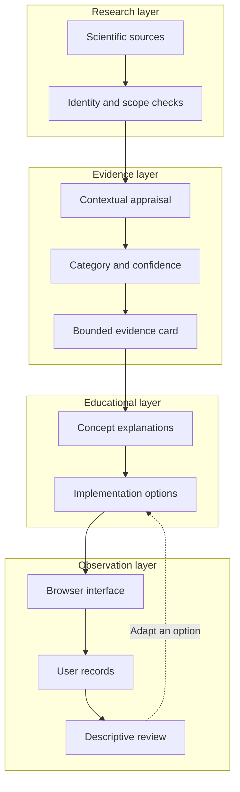

# System Architecture

## Why separate layers

Cognitive OS separates research, evidence, education, implementation, dashboard behavior and self-observation because these layers answer different questions. Research concerns what a study measured. Evidence review concerns how that result bears on a specified claim. Education concerns how to explain it. Implementation concerns a feasible choice in ordinary life. The dashboard concerns data handling. Self-observation concerns what a person recorded. A failure in one layer should be visible rather than hidden by the reputation of another.

## Research and evidence interfaces

Source verification records identity and access scope. A DOI or PMID identifies a publication but does not certify its quality. Review considers design, population, outcome, directness, consistency and available methodological information. The evidence card preserves a bounded statement, its category, confidence and limitations. Unresolved source identity and incomplete appraisal need visible status rather than an assigned letter that implies completion.

An evidence change can affect educational wording. For example, narrowing a population from adults generally to adults in a particular study setting changes the explanation's applicability. The architecture therefore favors explicit links between a statement and its supporting record. It does not expose complete research records in this public repository; public traceability is supplied by policies, selected references and reviewable documentation changes.

## Education and implementation interfaces

Educational components explain concepts, compare methods and describe uncertainty. A Master Guide is a conceptual reference; an Evidence Library is a bounded statement interface; an implementation program is a sequence of reflection; workbook concepts are structured recording aids. Their organization is authored design. A named worksheet or review interval is not automatically a research-validated intervention.

Implementation should be voluntary, feasible and limited to ordinary educational choices. A practice can be shortened or abandoned when it conflicts with real constraints. The interface should distinguish the intended task from the observation used to review it. No architecture arrow implies that following the sequence produces a particular cognitive outcome.

## Dashboard and data interfaces

The documented software design keeps records in browser-local storage and provides explicit JSON and CSV exports. The observation layer should preserve units, dates and missingness. Its summaries should describe coverage and avoid combining different measures into one cognitive score. Import is a validation boundary: malformed input should not silently replace valid observations.

The public repository supplies architecture documentation and selected screenshots, not a runnable application. Statements about validation must therefore identify the artifact tested rather than assume that documentation tests prove runtime behavior. Any future executable addition would require its own scope, threat analysis, licensing and validation record.

## Feedback and publication boundaries

Descriptive feedback returns to implementation, not scientific classification. An individual's improved rating can prompt a review of feasibility but cannot upgrade an evidence category. This prevents circular reasoning in which a framework uses its own diary output as validation.

Publication uses a curated manifest of public paths. Source-controlled Wiki pages, policy documents and original neutral assets belong in that scope. Personal records, credentials and unrelated implementation source do not. There is no automatic recursive mirror from another project directory. Technical boundaries must be checked alongside human review because a correct conceptual diagram cannot prevent accidental disclosure by itself.

## Navigation and attribution

[Wiki Home](https://github.com/Ciprian-LocalPulse/cognitive-os/blob/main/wiki-export/Home.md) · [Whitepaper](https://github.com/Ciprian-LocalPulse/cognitive-os/blob/main/WHITEPAPER.md) · [Documentation](https://github.com/Ciprian-LocalPulse/cognitive-os/blob/main/docs/README.md)

© 2026 Ciprian Ștefan Pleșca. Educational and informational use; not medical advice.
