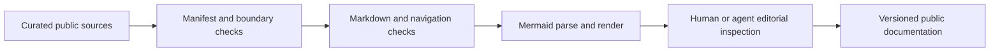

# Technical Validation and Testing

## What validation means here

The public repository validates documentation artifacts and publication boundaries. Its checks do not establish that Cognitive OS improves cognitive performance or constitutes medical software. A documentation test, a functional browser test, an accessibility review and a scientific appraisal answer different questions. Reporting them under one unqualified label of validated would hide those distinctions.

The current public documentation edition includes structural checks, internal navigation checks, external link checks and heuristic secret-pattern scanning. Mermaid blocks are parsed and rendered during release review. Markdown lint and spelling checks support readability. The scripts operate on a curated public manifest rather than copying unrelated project directories into publication scope.

## Structure and links

Structural checks identify missing files, unbalanced fences and invalid local paths. Navigation should connect the README, Whitepaper, documentation index, Wiki, architecture, evidence framework and policies. Wiki source files use public canonical links so that they remain navigable after synchronization into the separate Wiki Git repository.

External link checks record observed response status. A successful request proves availability at that time, not that the linked claim is scientifically correct. Publisher or hosting changes can break a previously valid link. Reference verification therefore also considers identity, title, authorship and scope rather than treating an HTTP response as evidence appraisal.

## Diagrams and editorial review

A valid Mermaid parse prevents syntax errors from becoming broken figures. Rendering allows inspection of labels, connections and reading order. The diagrams in this project describe workflows or conceptual relationships, not neural models or causal proof. Visual inspection should verify that a dotted contextual connection is not accidentally presented as a treatment pathway.

Markdown lint cannot assess the quality of academic reasoning, and a spelling dictionary cannot verify a citation. Editorial review remains necessary for measured wording, author attribution, uncertainty and the separation of evidence from interpretation. An automated success should identify its scope rather than imply independent peer review.

## Browser, privacy and accessibility concepts

The documented dashboard architecture needs checks for storage, exports, import validation, missing values and safe display if executable software is evaluated. A report should name the artifact version, engine, viewport and tested behavior. This public repository does not include that runtime, so its documentation checks must not be presented as a current cross-browser certification of an application.

Accessibility automation can identify some rule violations, but keyboard behavior, assistive technologies, cognitive load and physical devices need additional review. Privacy checks can inspect unexpected network requests, but no-request behavior does not encrypt browser storage or protect a shared profile. Security scanning is similarly bounded: patterns help identify likely secrets, not every possible disclosure.

## Version integrity and reproducibility

The VERSION file and CITATION.cff identify the documentation edition independently of other artifacts. A manifest makes the intended public file set explicit. Hashes can verify that a source-controlled export and its synchronized Wiki page contain identical bytes. Deterministic packaging is useful when fixed inputs and settings are available, but it does not establish scientific efficacy.

Release review should preserve the actual outputs and name any limitations. Future executable additions would require a new validation scope. The goal is reproducible, inspectable technical claims rather than a broad assurance that the entire framework is certified. See Research Methodology for scientific appraisal and Security for disclosure boundaries.

## Navigation and attribution

[Wiki Home](https://github.com/Ciprian-LocalPulse/cognitive-os/blob/main/wiki-export/Home.md) · [Whitepaper](https://github.com/Ciprian-LocalPulse/cognitive-os/blob/main/WHITEPAPER.md) · [Documentation](https://github.com/Ciprian-LocalPulse/cognitive-os/blob/main/docs/README.md)

© 2026 Ciprian Ștefan Pleșca. Educational and informational use; not medical advice.
